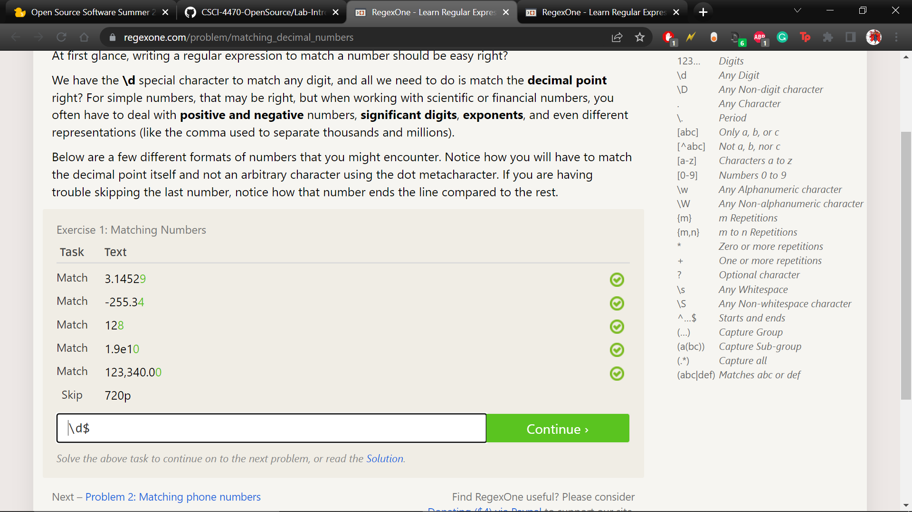

# Lab 01 Report - Introduction to Open Source Software
##1. Join the discord: Discord screenshot 
##2. Two suggestions for How to answer questions in helpful way:
Suggestions: 
Thank those that answered your question, more likely to get another answer from them down the line.
Don’t be afraid to ask the question even though it might not match all of the criteria of being a “smart question”.
## Chapter 3 reflection:
Chapter 3 of Free Culture introduces the significance of search engines and how it brought the Internet much closer to its users. The author uses an anecdote, Jesse from RPI, to show how “tinkering” with an existing piece of software can lead to legal trouble. This anecdote illustrates the legal implications that exist when working with material that is not entirely yours. The RIAA’s aggressiveness against Jesse shows how important it is to understand proprietary laws. As harmless as Jesse’s intentions were, he suffered an unexpected battle which could have been avoided if he had known what the rules were. Being a college student and exploring your curiosity, only to be met with a lawsuit seems ridiculous but also serves as an early example of how callous corporations can be when it comes to money. Jesse becoming an activist through this ordeal shows an apparent injustice that should not be overlookbloced in the programming world. Overall, this showed me that it is important to truly understand the meaning of “Open Source” and know what is legal and what is not. 
##3. Linux man Tree screenshot: 
##4. Practice RegEx problems:       
## Practice Crosswords:    
##5. Blockly sol'n: 
##6. Open Source reflection:
Qiskit is an open source software that I want to try and take advantage of. With quantum computing in early development, I’d like to use remote computers to try and contribute elementary projects that others may build off of and vice versa. Ultimately, I’d like to see if any of my efforts can make another qubit. There are many resources available to me for learning the python based language. My first goal will be to try the max-cut problem as it is difficult enough for me to learn enough content to tackle even harder problems. Another goal I have is to see how modeling techniques compare between standard and quantum computing. 
