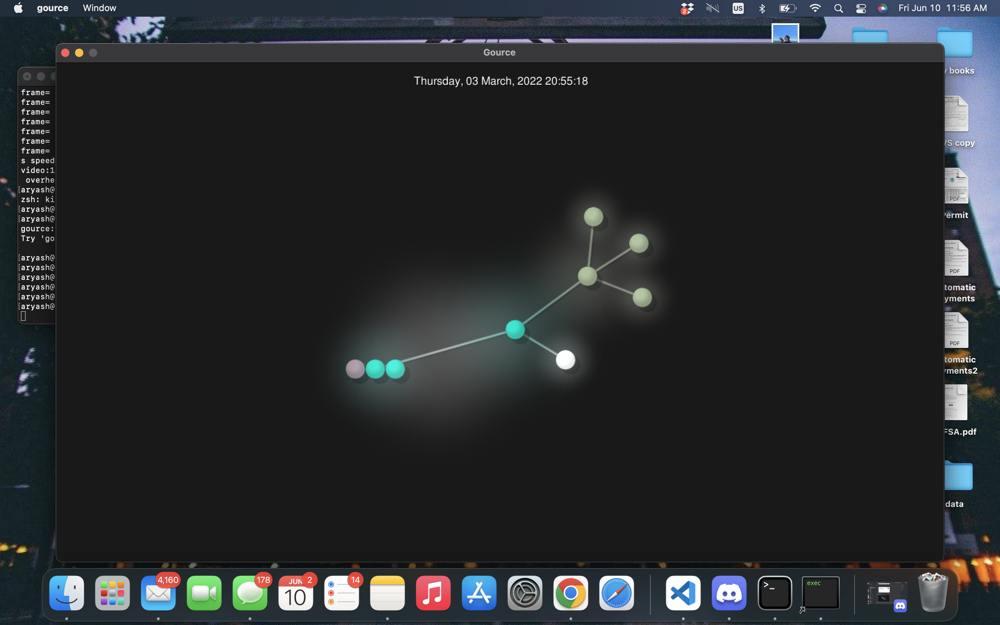
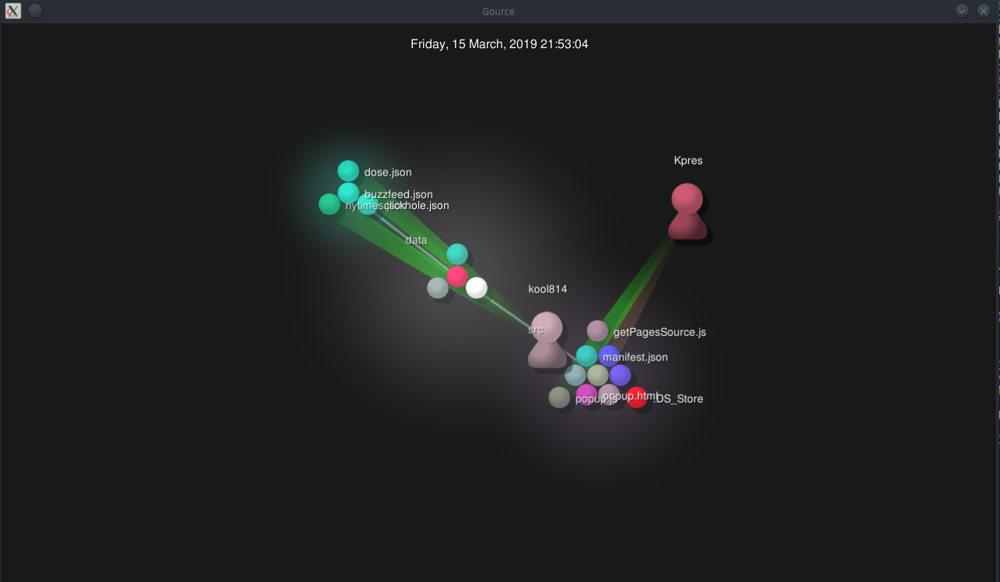
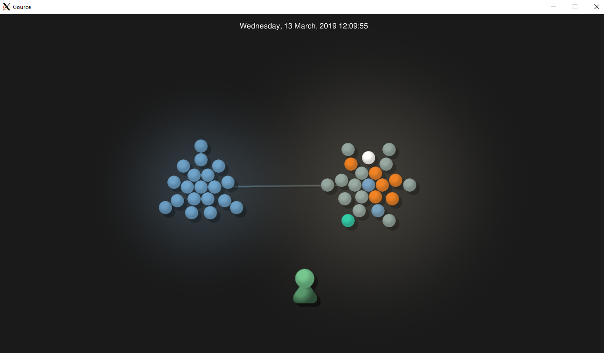
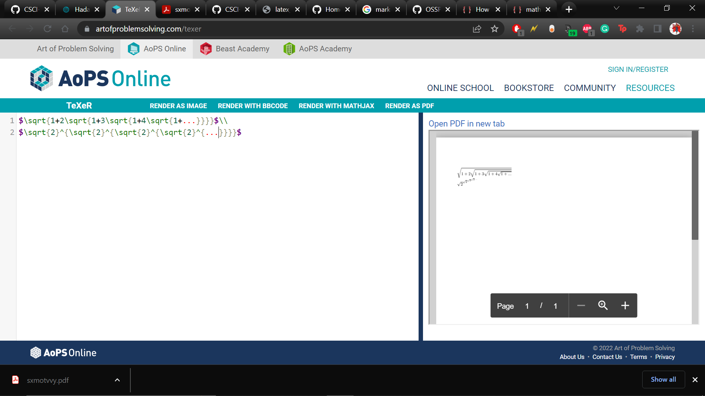
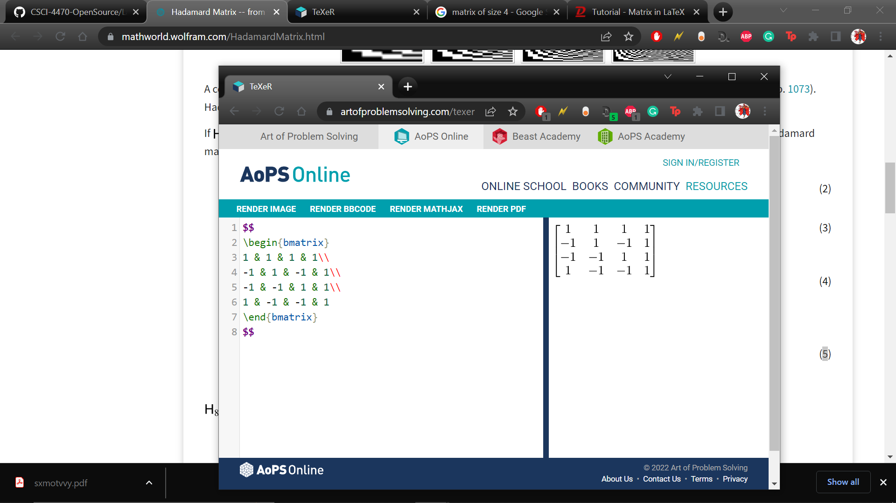

Java anagram open source project:
1.  Number of contributors: 2
2.  Number of lines: 19,820
3.  First commit: (https://github.com/tdurkin18/Anagrams/commit/e305ea4d0119cf2f2c3bcbd2503ac0fee96438e9)
4.  Last commit: https://github.com/tdurkin18/Anagrams/commit/695e3ba8e9d68a1f824d8692d92e920e147edbf3
5.  5 branches: Master, Jakev1, sameletters, gameBoard, and correct

## Gitstats differences:
1. Number of contributors: 30
2. Number of lines: 3924
3. First commit: 7/30/2007 
4. Last commit: 1/29/2019
5. Branches: Not shown

## other projects:
# TutorBase
number of contributors: 20
number of lines of code: 66647
the first commit: https://github.com/DangItJason/TutorBase/commit/3c3d08c884f763185e96d7b1e3fad02da67f5fdc
the latest commit: https://github.com/DangItJason/TutorBase/commit/998d18af40a26e3a207ee8d65498a2bc3e1f5006
the current branches: * master
  remotes/origin/HEAD -> origin/master
  remotes/origin/dependabot/npm_and_yarn/client/async-2.6.4
  remotes/origin/dependabot/npm_and_yarn/client/eventsource-1.1.1
  remotes/origin/dependabot/npm_and_yarn/client/minimist-1.2.6
  remotes/origin/dependabot/npm_and_yarn/client/moment-2.29.2
  remotes/origin/dependabot/npm_and_yarn/server/minimist-1.2.6
  remotes/origin/dependabot/npm_and_yarn/server/moment-2.29.2
  remotes/origin/develop
  remotes/origin/feature/appointmentconflicts
  remotes/origin/feature/block-tutor-dashboard
  remotes/origin/feature/image-upload
  remotes/origin/feature/log-out
  remotes/origin/feature/payment-channels
  remotes/origin/feature/tutor-signup
  remotes/origin/feature/typescriptSettings
  remotes/origin/feature/zoom-meetings
  remotes/origin/landing-redirect
  remotes/origin/master
  remotes/origin/meetingcard-fixes
  remotes/origin/saml-auth
  remotes/origin/tutorpfpicstor
  
# Clickbait extension
Contributors: 2
Lines of Code: 42597
First Commit: 1-22-2019
Latest Commit: 4-17-2019
Current Branch: master

# Catan-AI project
https://github.com/justinchen673/Catan-AI
number of contributors:3
number of lines of code:4058
first commit: January 14th 2019 https://github.com/justinchen673/Catan-AI/commit/97f641bc3e670d9823ae7e11d842f12af6171707
Latest commit:March 16th 2019 https://github.com/justinchen673/Catan-AI/commit/e4963f4d0810a57f761ea4e0245bc4e52977a333
Current branches:
        Master
        add-license-1
        Ports
        Empty_bot
        CatanReasearch
        Simple_Bot

# ARIS
Contributers:
17
Lines:
13174
Latest commit:
06/06/2022   https://github.com/Bram-Hub/aris/commit/b53b10ba4d5ee88dfd8a346e5142bb6d30dc8abc
First commit:
04/05/2017    https://github.com/Bram-Hub/aris/commit/69945fedb2c523904d3d0def66b4d7dfab65de83
Current Branches:
Master, gh-pages, change-focus, update-dependencies-web-app, clippy-fix, Key_Palette, proof_generate_solver, Disjunctive_syllogism

## I added the wiki page 
## latex images

## make file success:

## file made:

## full path for latex file
/home/south/Documents/Repos/CSCI-4470-OpenSource/Modules/01.Introduction/History/build/latex
