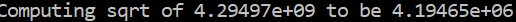

## Step 1:
tutorial.cxx:
// A simple program that computes the square root of a number
include <cmath>
include <iostream>
include <string>
include "TutorialConfig.h"
int main(int argc, char* argv[])
{
    if (argc < 2) {
	        // report version
		     std::cout << argv[0] << " Version " << Tutorial_VERSION_MAJOR << "."
		                   << Tutorial_VERSION_MINOR << std::endl;
		                       std::cout << "Usage: " << argv[0] << " number" << std::endl;
		                           return 1;
    }

  // convert input to double
  const double inputValue = std::stod(argv[1]);

  // calculate square root
  const double outputValue = sqrt(inputValue);
  std::cout << "The square root of " << inputValue << " is " << outputValue
            << std::endl;
  return 0;
}

Cmakelist.txt:
cmake_minimum_required(VERSION 3.10)
project(Tutorial VERSION 1.0)
add_executable(Tutorial tutorial.cxx)
configure_file(TutorialConfig.h.in TutorialConfig.h)
target_include_directories(Tutorial PUBLIC
	"${PROJECT_BINARY_DIR}"
)
Specify the C++ standard
set(CMAKE_CXX_STANDARD 11)
set(CMAKE_CXX_STANDARD_REQUIRED True)

Screenshots of Tutorial running:

## Step 2:
Tutorial.cxx:
// A simple program that computes the square root of a number
include <cmath>
include <iostream>
include <string>

include "TutorialConfig.h"
 include "MathFunctions.h"

int main(int argc, char* argv[])
{
  if (argc < 2) {
    // report version
    std::cout << argv[0] << " Version " << Tutorial_VERSION_MAJOR << "."
              << Tutorial_VERSION_MINOR << std::endl;
    std::cout << "Usage: " << argv[0] << " number" << std::endl;
    return 1;
  }

  // convert input to double
  const double inputValue = std::stod(argv[1]);

  // calculate square root
ifdef USE_MYMATH
    const double outputValue = mysqrt(inputValue);
else
    const double outputValue = sqrt(inputValue);
endif
  std::cout << "The square root of " << inputValue << " is " << outputValue
            << std::endl;
  return 0;
}
CMakeList.txt:
cmake_minimum_required(VERSION 3.10)

 set the project name and version
project(Tutorial VERSION 1.0)

 specify the C++ standard
set(CMAKE_CXX_STANDARD 11)
set(CMAKE_CXX_STANDARD_REQUIRED True)
option(USE_MYMATH "Use tutorial provided math implementation" ON)
 configure a header file to pass some of the CMake settings
 to the source code
configure_file(TutorialConfig.h.in TutorialConfig.h)

if(USE_MYMATH)
    add_subdirectory(MathFunctions)
    list(APPEND EXTRA_LIBS MathFunctions)
    list(APPEND EXTRA_INCLUDES "${PROJECT_SOURCE_DIR}/MathFunctions")
endif()

 add the executable
add_executable(Tutorial tutorial.cxx)

target_link_libraries(Tutorial PUBLIC ${EXTRA_LIBS})

 add the binary tree to the search path for include files
 so that we will find TutorialConfig.h
target_include_directories(Tutorial PUBLIC
        "${PROJECT_BINARY_DIR}"
        ${EXTRA_INCLUDES}
        )

Screenshot of output:
Tutorial: 
Tutorial 10: 
Tutorial 429: 

##  Step 3:
CMakeLists.txt:
cmake_minimum_required(VERSION 3.10)

 set the project name and version
project(Tutorial VERSION 1.0)

 specify the C++ standard
set(CMAKE_CXX_STANDARD 11)
set(CMAKE_CXX_STANDARD_REQUIRED True)

 should we use our own math functions
option(USE_MYMATH "Use tutorial provided math implementation" ON)

 configure a header file to pass some of the CMake settings
 to the source code
configure_file(TutorialConfig.h.in TutorialConfig.h)

 add the MathFunctions library
if(USE_MYMATH)
  add_subdirectory(MathFunctions)
  list(APPEND EXTRA_LIBS MathFunctions)

endif()

 add the executable
add_executable(Tutorial tutorial.cxx)

target_link_libraries(Tutorial PUBLIC ${EXTRA_LIBS})

 add the binary tree to the search path for include files
 so that we will find TutorialConfig.h
target_include_directories(Tutorial PUBLIC
                           "${PROJECT_BINARY_DIR}"

                           )

MathFunctions/CMakeLists.txt:
add_library(MathFunctions mysqrt.cxx)
target_include_directories(MathFunctions
        INTERFACE ${CMAKE_CURRENT_SOURCE_DIR}
        )

Screenshot of output:
Tutorial: 
Tutorial 10: 
Tutorial 429: 

## Step 4:
CMakeLists.txt: 
cmake_minimum_required(VERSION 3.10)

 set the project name and version
project(Tutorial VERSION 1.0)

 specify the C++ standard
set(CMAKE_CXX_STANDARD 11)
set(CMAKE_CXX_STANDARD_REQUIRED True)

 should we use our own math functions
option(USE_MYMATH "Use tutorial provided math implementation" ON)

 configure a header file to pass some of the CMake settings
 to the source code
configure_file(TutorialConfig.h.in TutorialConfig.h)

 add the MathFunctions library
if(USE_MYMATH)
  add_subdirectory(MathFunctions)
  list(APPEND EXTRA_LIBS MathFunctions)
endif()

 add the executable
add_executable(Tutorial tutorial.cxx)

target_link_libraries(Tutorial PUBLIC ${EXTRA_LIBS})

 add the binary tree to the search path for include files
 so that we will find TutorialConfig.h
target_include_directories(Tutorial PUBLIC
                           "${PROJECT_BINARY_DIR}"
                           )

install(TARGETS Tutorial DESTINATION bin)
install(FILES "${PROJECT_BINARY_DIR}/TutorialConfig.h"
        DESTINATION include
        )

enable_testing()

 does the application run
add_test(NAME Runs COMMAND Tutorial 25)

 does the usage message work?
add_test(NAME Usage COMMAND Tutorial)
set_tests_properties(Usage
        PROPERTIES PASS_REGULAR_EXPRESSION "Usage:.*number"
        )

 define a function to simplify adding tests
function(do_test target arg result)
  add_test(NAME Comp${arg} COMMAND ${target} ${arg})
  set_tests_properties(Comp${arg}
          PROPERTIES PASS_REGULAR_EXPRESSION ${result}
          )
endfunction()

 do a bunch of result based tests
do_test(Tutorial 4 "4 is 2")
do_test(Tutorial 9 "9 is 3")
do_test(Tutorial 5 "5 is 2.236")
do_test(Tutorial 7 "7 is 2.645")
do_test(Tutorial 25 "25 is 5")
do_test(Tutorial -25 "-25 is (-nan|nan|0)")
do_test(Tutorial 0.0001 "0.0001 is 0.01")

MathFunctions/CMakeLists.txt:
add_library(MathFunctions mysqrt.cxx)

 state that anybody linking to us needs to include the current source dir
 to find MathFunctions.h, while we dont.
target_include_directories(MathFunctions
          INTERFACE ${CMAKE_CURRENT_SOURCE_DIR}
          )
install(TARGETS MathFunctions DESTINATION lib)
install(FILES MathFunctions.h DESTINATION include)

Screenshot of output:

## Step 5:

CMakelists.txt:
cmake_minimum_required(VERSION 3.10)

 set the project name and version
project(Tutorial VERSION 1.0)

 specify the C++ standard
set(CMAKE_CXX_STANDARD 11)
set(CMAKE_CXX_STANDARD_REQUIRED True)

 should we use our own math functions
option(USE_MYMATH "Use tutorial provided math implementation" ON)

 configure a header file to pass some of the CMake settings
 to the source code
configure_file(TutorialConfig.h.in TutorialConfig.h)

 add the MathFunctions library
if(USE_MYMATH)
  add_subdirectory(MathFunctions)
  list(APPEND EXTRA_LIBS MathFunctions)
endif()

 add the executable
add_executable(Tutorial tutorial.cxx)
target_link_libraries(Tutorial PUBLIC ${EXTRA_LIBS})

 add the binary tree to the search path for include files
 so that we will find TutorialConfig.h
target_include_directories(Tutorial PUBLIC
                           "${PROJECT_BINARY_DIR}"
                           )

 add the install targets
install(TARGETS Tutorial DESTINATION bin)
install(FILES "${PROJECT_BINARY_DIR}/TutorialConfig.h"
  DESTINATION include
  )

 enable testing
enable_testing()

 does the application run
add_test(NAME Runs COMMAND Tutorial 25)

 does the usage message work?
add_test(NAME Usage COMMAND Tutorial)
set_tests_properties(Usage
  PROPERTIES PASS_REGULAR_EXPRESSION "Usage:.*number"
  )

 define a function to simplify adding tests
function(do_test target arg result)
  add_test(NAME Comp${arg} COMMAND ${target} ${arg})
  set_tests_properties(Comp${arg}
    PROPERTIES PASS_REGULAR_EXPRESSION ${result}
    )
endfunction()

 do a bunch of result based tests
do_test(Tutorial 4 "4 is 2")
do_test(Tutorial 9 "9 is 3")
do_test(Tutorial 5 "5 is 2.236")
do_test(Tutorial 7 "7 is 2.645")
do_test(Tutorial 25 "25 is 5")
do_test(Tutorial -25 "-25 is (-nan|nan|0)")
do_test(Tutorial 0.0001 "0.0001 is 0.01")

MathFunctions/CMakeLists.txt:
add_library(MathFunctions mysqrt.cxx)

 state that anybody linking to us needs to include the current source dir
 to find MathFunctions.h, while we dont.
target_include_directories(MathFunctions
        INTERFACE ${CMAKE_CURRENT_SOURCE_DIR}
        )

 does this system provide the log and exp functions?
include(CheckCXXSourceCompiles)
check_cxx_source_compiles("
  include <cmath>
  int main() {
    std::log(1.0);
    return 0;
  }
" HAVE_LOG)
check_cxx_source_compiles("
  include <cmath>
  int main() {
    std::exp(1.0);
    return 0;
  }
" HAVE_EXP)

 add compile definitions
if(HAVE_LOG AND HAVE_EXP)
    target_compile_definitions(MathFunctions
            PRIVATE "HAVE_LOG" "HAVE_EXP")
endif()

install rules
install(TARGETS MathFunctions DESTINATION lib)
install(FILES MathFunctions.h DESTINATION include)

Screenshot of output:

			
## Makefile
Manual makefile with outputs screenshot:
			all: dynamic_block static_block
clean:
		rm dynamic_block static_block 

dynamic_block: program.o dlib.so
	gcc program.o dlib.so -o dynamic_block -Wl,-rpath='$$ORIGIN'
static_block: program.o slib.a 
	gcc program.o slib.a -o static_block -Wl,-rpath='$$ORIGIN'
program.o: program.c	
	gcc -c program.c -o program.o
dlib.so: lib2.o 
	gcc -shared lib2.o -o dlib.so
slib.a: lib.o
	ar -rcs slib.a lib.o
lib.o: source/block.c headers/block.h
	gcc -c source/block.c -o lib.o
lib2.o: source/block.c headers/block.h 
	gcc -fPIC -c source/block.c -o lib2.o 
ock.c -o lib2.o 

			
			
## CMake file
Cmake results: 

cmake_minimum_required(VERSION 3.0)
project(proyect C)

add_library(dylib SHARED source/block.c headers/block.h )
add_library( stlib STATIC source/block.c headers/block.h )

add_executable(dBlock program.c)
target_link_libraries(dBlock dylib)

add_executable(sBlock program.c)
target_link_libraries(sBlock stlib)
			
			
## Cmake Makefile:
 CMAKE generated file: DO NOT EDIT!
 Generated by "Unix Makefiles" Generator, CMake Version 3.24

 Default target executed when no arguments are given to make.
default_target: all
.PHONY : default_target

 Allow only one "make -f Makefile2" at a time, but pass parallelism.
.NOTPARALLEL:

=============================================================================
 Special targets provided by cmake.

 Disable implicit rules so canonical targets will work.
.SUFFIXES:

 Disable VCS-based implicit rules.
% : %,v

 Disable VCS-based implicit rules.
% : RCS/%

 Disable VCS-based implicit rules.
% : RCS/%,v

 Disable VCS-based implicit rules.
% : SCCS/s.%

 Disable VCS-based implicit rules.
% : s.%

.SUFFIXES: .hpux_make_needs_suffix_list

 Command-line flag to silence nested $(MAKE).
$(VERBOSE)MAKESILENT = -s

Suppress display of executed commands.
$(VERBOSE).SILENT:

 A target that is always out of date.
cmake_force:
.PHONY : cmake_force

=============================================================================
 Set environment variables for the build.

 The shell in which to execute make rules.
SHELL = /bin/sh

 The CMake executable.
CMAKE_COMMAND = /home/south/cmake/bin/cmake

 The command to remove a file.
RM = /home/south/cmake/bin/cmake -E rm -f

 Escaping for special characters.
EQUALS = =

 The top-level source directory on which CMake was run.
CMAKE_SOURCE_DIR = /mnt/c/users/south/dropbox/OpenSourceSoft/CSCI-4470-OpenSource/modules/05.BuildSystems/Lab-BuildSystemsExample

 The top-level build directory on which CMake was run.
CMAKE_BINARY_DIR = /mnt/c/users/south/dropbox/OpenSourceSoft/CSCI-4470-OpenSource/modules/05.BuildSystems/Lab-BuildSystemsExample

=============================================================================
 Targets provided globally by CMake.

 Special rule for the target edit_cache
edit_cache:
	@$(CMAKE_COMMAND) -E cmake_echo_color --switch=$(COLOR) --cyan "Running CMake cache editor..."
	/home/south/cmake/bin/ccmake -S$(CMAKE_SOURCE_DIR) -B$(CMAKE_BINARY_DIR)
.PHONY : edit_cache

 Special rule for the target edit_cache
edit_cache/fast: edit_cache
.PHONY : edit_cache/fast

 Special rule for the target rebuild_cache
rebuild_cache:
	@$(CMAKE_COMMAND) -E cmake_echo_color --switch=$(COLOR) --cyan "Running CMake to regenerate build system..."
	/home/south/cmake/bin/cmake --regenerate-during-build -S$(CMAKE_SOURCE_DIR) -B$(CMAKE_BINARY_DIR)
.PHONY : rebuild_cache

 Special rule for the target rebuild_cache
rebuild_cache/fast: rebuild_cache
.PHONY : rebuild_cache/fast

 The main all target
all: cmake_check_build_system
	$(CMAKE_COMMAND) -E cmake_progress_start /mnt/c/users/south/dropbox/OpenSourceSoft/CSCI-4470-OpenSource/modules/05.BuildSystems/Lab-BuildSystemsExample/CMakeFiles /mnt/c/users/south/dropbox/OpenSourceSoft/CSCI-4470-OpenSource/modules/05.BuildSystems/Lab-BuildSystemsExample//CMakeFiles/progress.marks
	$(MAKE) $(MAKESILENT) -f CMakeFiles/Makefile2 all
	$(CMAKE_COMMAND) -E cmake_progress_start /mnt/c/users/south/dropbox/OpenSourceSoft/CSCI-4470-OpenSource/modules/05.BuildSystems/Lab-BuildSystemsExample/CMakeFiles 0
.PHONY : all

 The main clean target
clean:
	$(MAKE) $(MAKESILENT) -f CMakeFiles/Makefile2 clean
.PHONY : clean

 The main clean target
clean/fast: clean
.PHONY : clean/fast

 Prepare targets for installation.
preinstall: all
	$(MAKE) $(MAKESILENT) -f CMakeFiles/Makefile2 preinstall
.PHONY : preinstall

 Prepare targets for installation.
preinstall/fast:
	$(MAKE) $(MAKESILENT) -f CMakeFiles/Makefile2 preinstall
.PHONY : preinstall/fast

 clear depends
depend:
	$(CMAKE_COMMAND) -S$(CMAKE_SOURCE_DIR) -B$(CMAKE_BINARY_DIR) --check-build-system CMakeFiles/Makefile.cmake 1
.PHONY : depend

=============================================================================
 Target rules for targets named dylib

 Build rule for target.
dylib: cmake_check_build_system
	$(MAKE) $(MAKESILENT) -f CMakeFiles/Makefile2 dylib
.PHONY : dylib

 fast build rule for target.
dylib/fast:
	$(MAKE) $(MAKESILENT) -f CMakeFiles/dylib.dir/build.make CMakeFiles/dylib.dir/build
.PHONY : dylib/fast

=============================================================================
 Target rules for targets named stlib

 Build rule for target.
stlib: cmake_check_build_system
	$(MAKE) $(MAKESILENT) -f CMakeFiles/Makefile2 stlib
.PHONY : stlib

 fast build rule for target.
stlib/fast:
	$(MAKE) $(MAKESILENT) -f CMakeFiles/stlib.dir/build.make CMakeFiles/stlib.dir/build
.PHONY : stlib/fast

=============================================================================
 Target rules for targets named dBlock

 Build rule for target.
dBlock: cmake_check_build_system
	$(MAKE) $(MAKESILENT) -f CMakeFiles/Makefile2 dBlock
.PHONY : dBlock

 fast build rule for target.
dBlock/fast:
	$(MAKE) $(MAKESILENT) -f CMakeFiles/dBlock.dir/build.make CMakeFiles/dBlock.dir/build
.PHONY : dBlock/fast

=============================================================================
 Target rules for targets named sBlock

 Build rule for target.
sBlock: cmake_check_build_system
	$(MAKE) $(MAKESILENT) -f CMakeFiles/Makefile2 sBlock
.PHONY : sBlock

 fast build rule for target.
sBlock/fast:
	$(MAKE) $(MAKESILENT) -f CMakeFiles/sBlock.dir/build.make CMakeFiles/sBlock.dir/build
.PHONY : sBlock/fast

program.o: program.c.o
.PHONY : program.o

 target to build an object file
program.c.o:
	$(MAKE) $(MAKESILENT) -f CMakeFiles/dBlock.dir/build.make CMakeFiles/dBlock.dir/program.c.o
	$(MAKE) $(MAKESILENT) -f CMakeFiles/sBlock.dir/build.make CMakeFiles/sBlock.dir/program.c.o
.PHONY : program.c.o

program.i: program.c.i
.PHONY : program.i

 target to preprocess a source file
program.c.i:
	$(MAKE) $(MAKESILENT) -f CMakeFiles/dBlock.dir/build.make CMakeFiles/dBlock.dir/program.c.i
	$(MAKE) $(MAKESILENT) -f CMakeFiles/sBlock.dir/build.make CMakeFiles/sBlock.dir/program.c.i
.PHONY : program.c.i

program.s: program.c.s
.PHONY : program.s

 target to generate assembly for a file
program.c.s:
	$(MAKE) $(MAKESILENT) -f CMakeFiles/dBlock.dir/build.make CMakeFiles/dBlock.dir/program.c.s
	$(MAKE) $(MAKESILENT) -f CMakeFiles/sBlock.dir/build.make CMakeFiles/sBlock.dir/program.c.s
.PHONY : program.c.s

source/block.o: source/block.c.o
.PHONY : source/block.o

 target to build an object file
source/block.c.o:
	$(MAKE) $(MAKESILENT) -f CMakeFiles/dylib.dir/build.make CMakeFiles/dylib.dir/source/block.c.o
	$(MAKE) $(MAKESILENT) -f CMakeFiles/stlib.dir/build.make CMakeFiles/stlib.dir/source/block.c.o
.PHONY : source/block.c.o

source/block.i: source/block.c.i
.PHONY : source/block.i

 target to preprocess a source file
source/block.c.i:
	$(MAKE) $(MAKESILENT) -f CMakeFiles/dylib.dir/build.make CMakeFiles/dylib.dir/source/block.c.i
	$(MAKE) $(MAKESILENT) -f CMakeFiles/stlib.dir/build.make CMakeFiles/stlib.dir/source/block.c.i
.PHONY : source/block.c.i

source/block.s: source/block.c.s
.PHONY : source/block.s

 target to generate assembly for a file
source/block.c.s:
	$(MAKE) $(MAKESILENT) -f CMakeFiles/dylib.dir/build.make CMakeFiles/dylib.dir/source/block.c.s
	$(MAKE) $(MAKESILENT) -f CMakeFiles/stlib.dir/build.make CMakeFiles/stlib.dir/source/block.c.s
.PHONY : source/block.c.s

 Help Target
help:
	@echo "The following are some of the valid targets for this Makefile:"
	@echo "... all (the default if no target is provided)"
	@echo "... clean"
	@echo "... depend"
	@echo "... edit_cache"
	@echo "... rebuild_cache"
	@echo "... dBlock"
	@echo "... dylib"
	@echo "... sBlock"
	@echo "... stlib"
	@echo "... program.o"
	@echo "... program.i"
	@echo "... program.s"
	@echo "... source/block.o"
	@echo "... source/block.i"
	@echo "... source/block.s"
.PHONY : help

=============================================================================
 Special targets to cleanup operation of make.

 Special rule to run CMake to check the build system integrity.
 No rule that depends on this can have commands that come from listfiles
 because they might be regenerated.
cmake_check_build_system:
	$(CMAKE_COMMAND) -S$(CMAKE_SOURCE_DIR) -B$(CMAKE_BINARY_DIR) --check-build-system CMakeFiles/Makefile.cmake 0
.PHONY : cmake_check_build_system

ock.c -o lib2.o 
ock.c -o lib2.o 

## Relative sizes
static block: sBlock is 16,856
dynamic block: dBlock is 16,696

