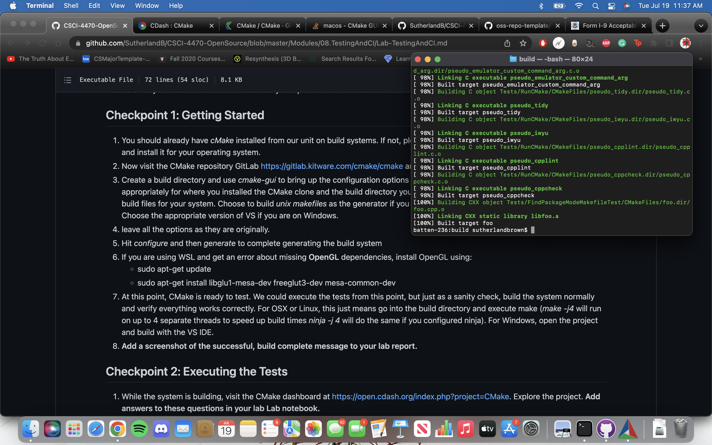
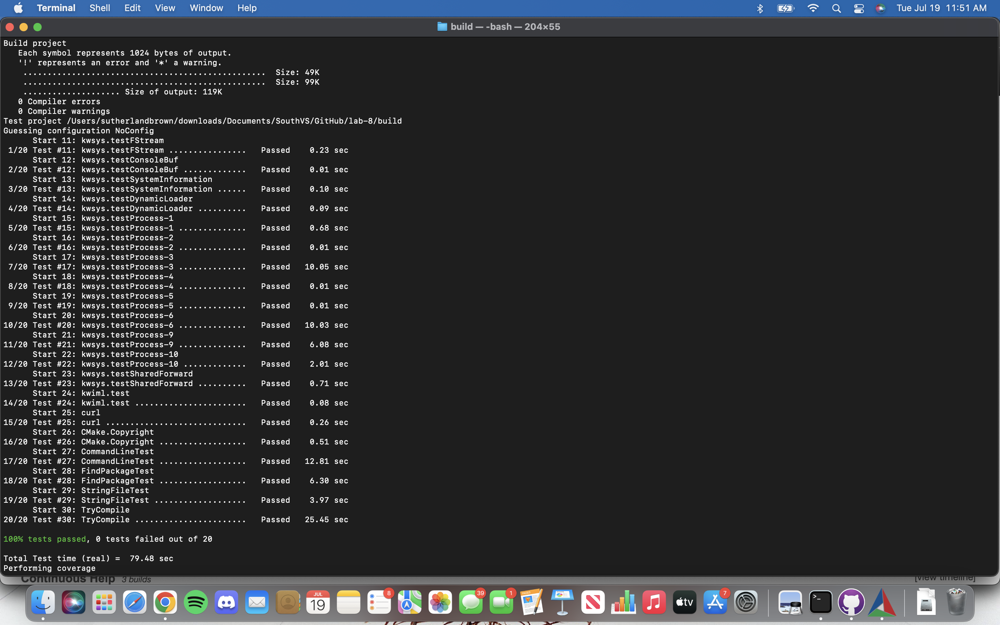
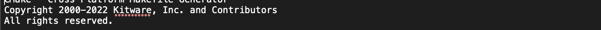
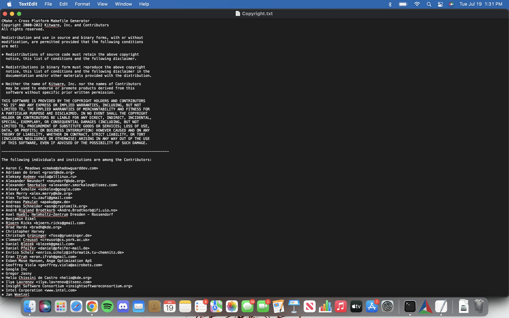
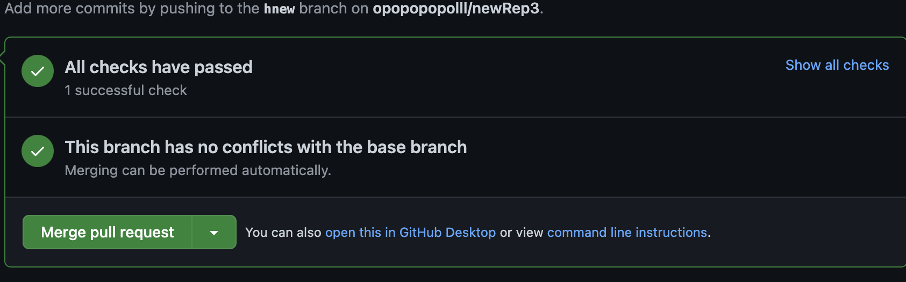
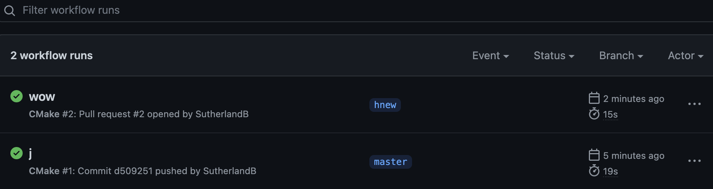

# Checkpoint 1:

# Checkpoint 2: Find the Nightly and Experimental sections and look at some of the submissions. How can you see what tests were run for a particular submission?

By looking at the test tab on the dashboard, I was able to tell how many tests were passed or failed. 
By clicking on the number that was shown, the specific tests that were ran on the build was shown. 

Find a submission with errors. Can you see what the error condition was? How does this help you debug the failure?
In the nightly tab, I chose AIX-7.2_GCC-7.2.0 to see its errors. The error that showed up was "CMake Error at 
/scratch/atkins3/Dashboards/CMake/Builds/GCC_7.2.0/CMake-build/Tests/CTestTestTimeout/test.cmake:34 (message): Log indicates timeout did not kill child."
Seeing that there are child processes not being killed, that means that some logic in executing multiprocessers is a problem. 
Debugging would probably start near fork calls or other multiprocess keywords. 

Find a system that is close to your specific configuration in the Nightly, Nightly Expected or one of the Masters sections. 
How clean is the dashboard? Are there any errors that you need to be concerned with? 

I chose to do the nightly-cmake-macos_arm64_xcode build. The dashboard is clean and easily readable. There were some minor issues with a test but 
there were no warnings for building. The error in its test 
was compiling a headerSet and that only makes the build slightly unstable.

# Checkpoint 3:
testfail: 
Change: 
test success: 
# Checkpoint 4:
Pull request: 
workflows: 

 
