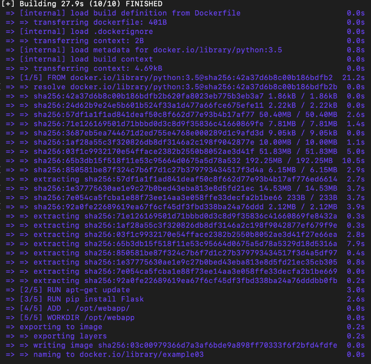

# Check00: 

# Check01: 

# Check02: 
Database: Mongo

RocketChat:

# Check03:
Creating docker file:

Message appeared on port 5000:

# Check04:
Creating docker file:

First hello message:

Deletion of message:

